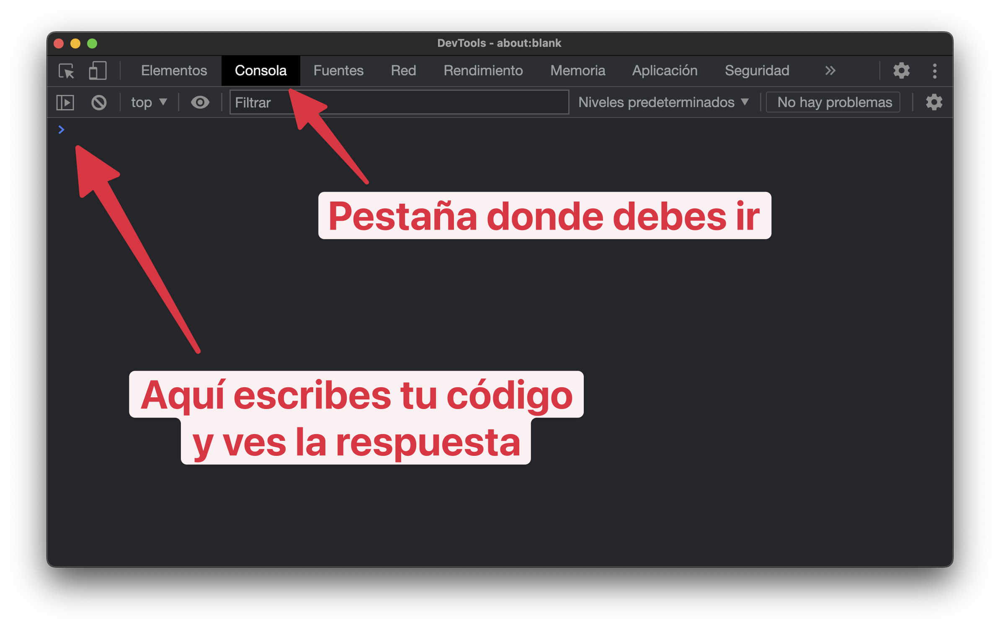

# La consola del navegador

Para poder seguir el curso y probar lo que vas haciendo necesitarás por ahora un navegador web. Seguramente ya tengas uno instalado, si no es así, te recomiendo que instales Google Chrome o Brave Browser.

Todos los navegadores tienen una herramienta llamada consola. La consola nos permite ejecutar código JavaScript en tiempo real y ver el resultado. También ahí podemos ver los errores, advertencias y trazas que se producen en nuestro código.

Aunque podemos ejecutar código JavaScript de otras formas, para empezar, vamos a usar esta herramienta que nos ofrece el navegador.

Recuerda que llamamos código a las instrucciones que le damos a la computadora para que haga algo.

Cómo abrir la consola
Para abrir la consola del navegador debes hacer lo siguiente:

Abre tu navegador web favorito, por ejemplo, Google Chrome.
Ve a la página about:blank en la barra de direcciones. Así evitaremos que la página web que hemos cargado nos moleste.
Haz click derecho en cualquier parte de la página y selecciona la opción Inspeccionar Elemento o Inspect.
Aquí podrás ejecutar tu código JavaScript y ver el resultado. Es lo que usaremos en las primeras clases del curso. Más adelante pasaremos a usar un editor de código más potente.

