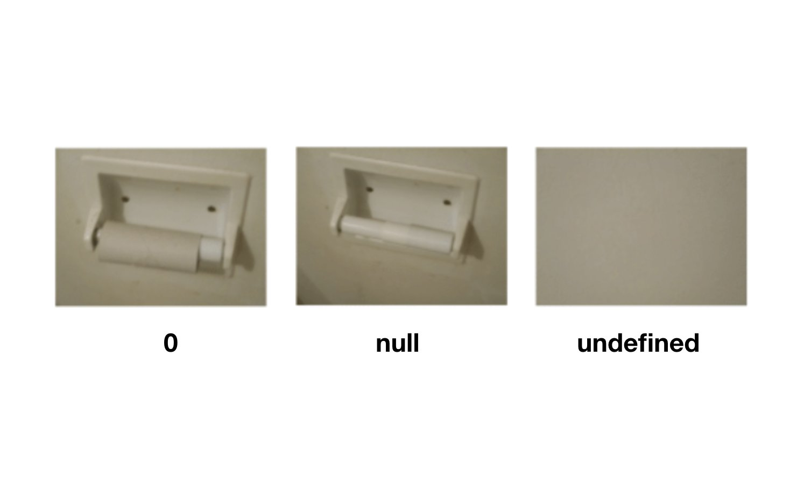

# null y undefined

¿Recuerdas que te he comentado que existen diferentes tipos de datos en JavaScript? Hemos visto números, cadenas de texto y booleanos.

En esta clase vas a aprender otros dos tipos de datos que, aunque son similares, tienen ligeras diferencias. Son null y undefined.

La particularidad de estos dos tipos de datos es que cada uno sólo tiene un valor. El tipo null sólo puede tener el valor null y el tipo undefined sólo puede tener el valor undefined.

Es como el tipo booleano que podía ser true y false pero, en este caso, sólo tiene un valor.

La diferencia entre null y undefined
Mientras que null es un valor que significa que algo no tiene valor, undefined significa que algo no ha sido definido. Por ejemplo, si creamos una variable sin asignarle ningún valor, su valor será undefined:

let rolloDePapel // -> undefined
También podemos asignar directamente el valor undefined a una variable:

let rolloDePapel = undefined // -> undefined
En cambio, para que una variable tenga el valor null, sólo podemos conseguirlo asignándole explícitamente ese valor:

let rolloDePapel = null
Un caso bastante ilustrativo para entender la diferencia entre null y undefined es el siguiente:

